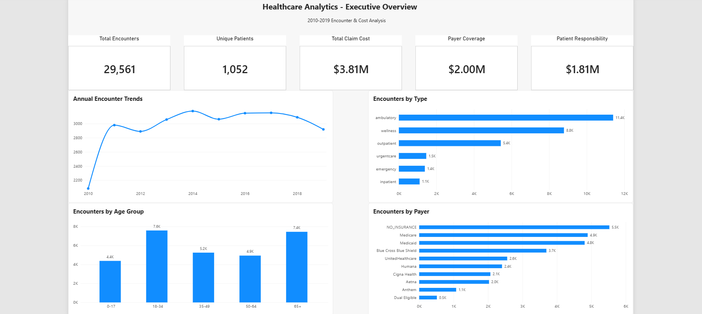
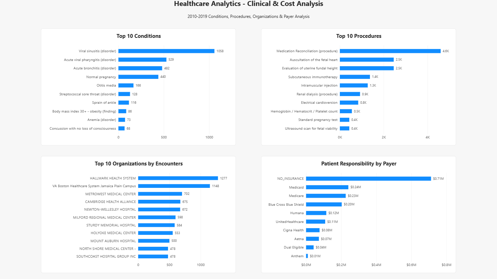

# End-to-End Healthcare Data Pipeline & Analytics Dashboard

Built an end-to-end healthcare analytics pipeline that transforms raw synthetic healthcare data into analytics-ready datasets and interactive Power BI dashboards.

**Tech Stack:** AWS S3 | Databricks | PySpark | SQL | Delta Lake | Power BI

**Pipeline:** Synthea CSV Data → AWS S3 → Databricks → Bronze/Silver/Gold Delta Tables → Power BI

### Project Highlights
- Built a Medallion Architecture pipeline using PySpark and SQL for data ingestion, cleaning, validation, and aggregation.
- Processed healthcare data covering patients, encounters, conditions, procedures, organizations, providers, and payers.
- Created 8 Gold-layer analytical tables for business-focused reporting.
- Built a two-page Power BI dashboard analyzing 29,561 encounters, 1,052 patients, and $3.81M in claim costs.
- Performed data quality checks for nulls, duplicates, row counts, and derived fields.

## Dashboard Preview



## Technologies

- **AWS S3** — Cloud storage for raw healthcare data
- **Databricks** — Data processing and analytics environment
- **PySpark** — Data cleaning, transformation, and validation
- **SQL** — Aggregation and creation of analytics-ready datasets
- **Delta Lake** — Storage format for Bronze, Silver, and Gold tables
- **Power BI** — Interactive dashboard development and data visualization
- **GitHub** — Version control and project documentation

## Data Pipeline

The project follows a Medallion Architecture to progressively transform raw healthcare data into analytics-ready datasets.

### Bronze Layer
- Ingested raw Synthea healthcare CSV files from AWS S3 into Databricks.
- Preserved the original source data for downstream processing.

### Silver Layer
- Cleaned and transformed core healthcare datasets using PySpark.
- Standardized data types and handled data quality issues.
- Created derived fields such as patient age, age groups, encounter year, and patient responsibility.
- Performed validation checks for nulls, duplicates, row counts, and calculated fields.

### Gold Layer
Created business-focused aggregate tables optimized for reporting and analysis, including:

- Executive KPIs
- Encounter trends
- Encounter types
- Patient demographics
- Condition analysis
- Procedure analysis
- Organization performance
- Payer performance

The Gold tables serve as the reporting layer consumed by Power BI.

## Power BI Dashboard

Power BI connects to the Gold-layer tables to provide two reporting views focused on healthcare utilization, clinical activity, and financial performance.

### Executive Overview

The Executive Overview summarizes key healthcare metrics and utilization patterns from 2010–2019, including encounter volume, patient counts, claim costs, payer coverage, patient responsibility, encounter types, demographics, and payer activity.


### Clinical & Cost Analysis

The Clinical & Cost Analysis page provides deeper analysis of the most common conditions and procedures, high-volume healthcare organizations, and patient financial responsibility by payer.



## Key Insights

- The 2010–2019 analysis includes **29,561 encounters across 1,052 unique patients**.
- Total claim costs reached approximately **$3.81M**, with **$2.00M covered by payers** and **$1.81M attributed to patient responsibility**.
- **Ambulatory encounters** were the most common encounter type, followed by wellness and outpatient visits.
- Patients aged **65+** accounted for the largest encounter volume among the analyzed age groups.
- **Viral sinusitis** was the most frequently recorded condition, while **Medication Reconciliation** was the most common procedure.
- **Hallmark Health System** recorded the highest encounter volume among organizations in the Gold-layer analysis.
- Encounters categorized as **NO_INSURANCE** generated the highest total patient responsibility among payer categories, at approximately **$0.71M**.

## Repository Structure

```text
healthcare-data-analytics-pipeline/
│
├── notebooks/
│   └── healthcare_analytics_pipeline.ipynb
│
├── dashboard/
│   └── Healthcare_Analytics_Dashboard.pbix
│
├── images/
│   ├── executive_overview.png
│   └── clinical_cost_analysis.png
│
└── README.md
```

## Dataset

This project uses synthetic healthcare data generated by Synthea. The dataset contains simulated patient healthcare records, including patients, encounters, conditions, procedures, providers, organizations, and payer information.

Synthetic data was used so the project could demonstrate healthcare data engineering and analytics workflows without exposing real patient information.

The raw CSV files are not included in this repository. They are ingested into AWS S3 and processed through the Databricks pipeline.

## How to Run

1. Generate or obtain the Synthea healthcare dataset.
2. Upload the raw CSV files to an AWS S3 bucket.
3. Configure Databricks to access the source data.
4. Import and run `notebooks/healthcare_analytics_pipeline.ipynb`.
5. Run the notebook sequentially to create the cleaned Silver tables and analytics-ready Gold tables.
6. Connect Power BI to the Databricks SQL Warehouse.
7. Load the Gold tables and open or recreate the Power BI dashboard.

> Note: Cloud resource names, credentials, and environment-specific connection settings are not included in this repository.

## Project Outcomes

This project demonstrates an end-to-end healthcare analytics workflow, including:

- Cloud-based data ingestion and storage using AWS S3
- Data cleaning and transformation with PySpark
- Data quality validation and investigation
- Medallion architecture using Silver and Gold Delta tables
- SQL-based analytical aggregations
- Healthcare utilization and cost analysis
- Power BI dashboard development
- Translation of processed healthcare data into business-facing insights
